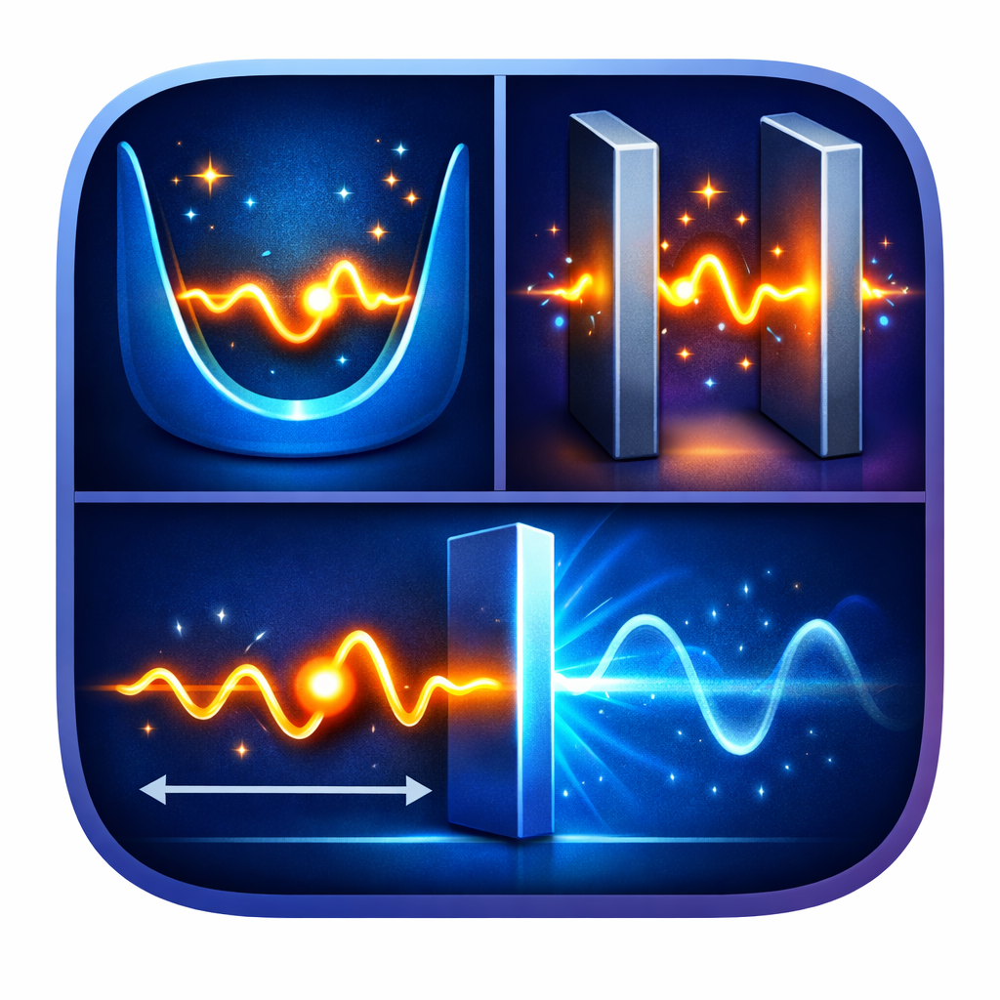

# Quantum Particle Scenarios ⚛️

  

Educational Android application built with **Jetpack Compose** to visualize
fundamental scenarios of **Quantum Mechanics** through wave functions and
probability densities.

This project is conceived as a **didactic and exploratory tool**, not as a
high-precision numerical solver.

---

## 📘 Scenarios Included

### 1️⃣ Particle in an Infinite Potential Well
- Confined particle between rigid walls
- Discrete energy states
- Standing wave solutions ψ(x)

### 2️⃣ Particle in a Linear Potential (Electric Field)
- Analogy with a particle between parallel plates
- Linear potential U(x)
- Particular solutions and Airy-function-based solution
- Animated “Bessel-like” illustrative solution

### 3️⃣ Particle and Finite Potential Barrier
- Free regions and barrier region
- Energy **E > U**: oscillatory behavior
- Energy **E < U**: quantum tunneling with evanescent decay

### 4️⃣ Probability Density Analysis
- Calculation and visualization of |ψ(x)|²
- Physical interpretation of measurable quantities

---

## 🧠 Educational Philosophy

- Clean separation between **physics**, **state**, and **UI**
- Emphasis on conceptual clarity rather than mathematical complexity
- Visual intuition over abstract formalism
- Designed to be readable and understandable by students and enthusiasts

---

## 🛠️ Technologies Used

- **Kotlin**
- **Jetpack Compose**
- **MVVM architecture**
- **Canvas-based custom drawing**
- **Numerical integration (Runge–Kutta)**

---

## 📂 Project Structure

- `QuantumViewModel`  
  Handles all physical models and wave function calculations

- UI Composables  
  Responsible for visualization and user interaction

- Shared Wave Function  
  A single ψ(x) state reused across scenarios for analysis

---

## 🚀 How to Run

1. Clone the repository
2. Open with **Android Studio**
3. Let Gradle sync
4. Run on emulator or physical device

---

## 👤 Author

**ELPD – 2026**

This project was created as a personal study and teaching tool
for exploring quantum mechanical concepts through visualization.

---

> *“The wave is not what happens.  
> The wave is what can happen.”*
